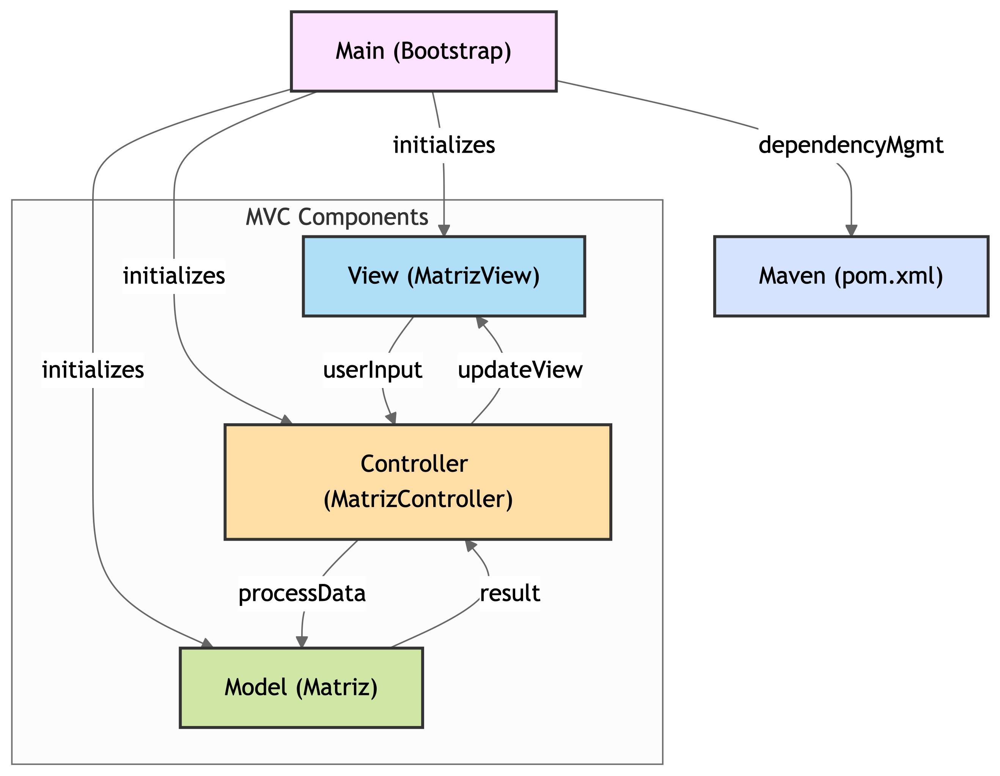
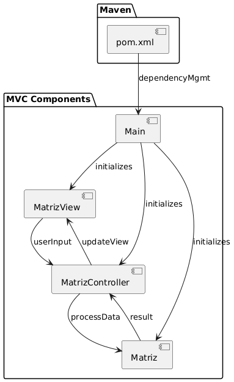

# Prueba-SOLID-Ejer1

Este proyecto es una aplicación Java con interfaz gráfica construida con JavaFX, que permite al usuario ingresar una matriz y ver su transpuesta. Está diseñado usando el patrón arquitectónico **MVC (Modelo-Vista-Controlador)** y sigue los principios **SOLID** para una arquitectura limpia, mantenible y extensible.

---

## Principios SOLID Aplicados

### 1. **S - Single Responsibility Principle (Responsabilidad Única)**
Cada clase tiene **una sola responsabilidad clara**:

- `Matriz` (Modelo): solo se encarga de almacenar y procesar los datos de la matriz.
- `MatrizView`: solo gestiona la interfaz gráfica con el usuario.
- `MatrizController`: actúa como puente entre la vista y el modelo, respondiendo a eventos y coordinando acciones.

### 2. **O - Open/Closed Principle (Abierto/Cerrado)**
El código está diseñado para que **pueda extenderse sin modificarse**:

- Puedes agregar nuevas operaciones en `Matriz` (como suma o multiplicación de matrices) sin modificar la clase existente.
- La vista puede mejorarse (diseño, temas) sin tocar el modelo o el controlador.

### 3. **L - Liskov Substitution Principle (Sustitución de Liskov)**
Las clases están preparadas para que **puedan ser extendidas sin romper el comportamiento** esperado:

- Podrías extender la clase `Matriz` (por ejemplo, `MatrizCuadrada`) y seguir usando `transpuesta()` sin errores.
- Podrías extender `MatrizView` si quisieras una vista alternativa (por ejemplo, modo consola o web).

### 4. **I - Interface Segregation Principle (Segregación de Interfaces)**
Aunque este ejemplo no define interfaces explícitas, se cumple el principio porque:

- Ninguna clase está obligada a implementar métodos que no necesita.
- Cada clase es compacta y modular.

### 5. **D - Dependency Inversion Principle (Inversión de Dependencias)**
Las **dependencias están dirigidas hacia abstracciones y no hacia implementaciones concretas**:

- La vista y el controlador se comunican mediante eventos (`ActionListener`), no se conocen directamente.
- El controlador depende del modelo solo a través de sus métodos públicos.

---

## 📁 Estructura del Proyecto

Diagrama del Proyecto: 

### Diagrama de Paquetes:

Diagrama de Clases:

Diagrama de Componentes:

Diagrama de Objetos:

### Enlaces

Enlace al repositorio: https://github.com/YoelUb/Prueba-SOLID-Ejer1

